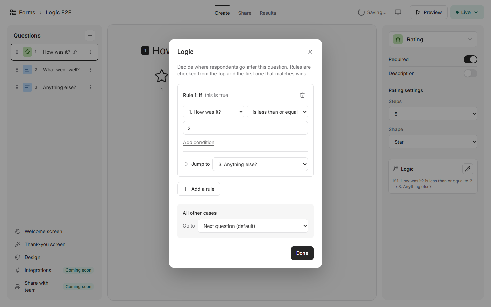
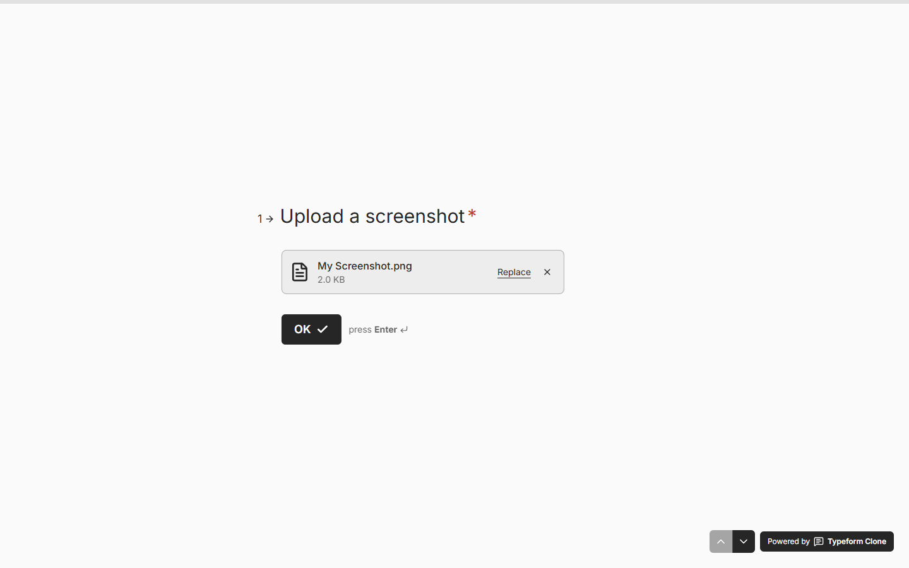
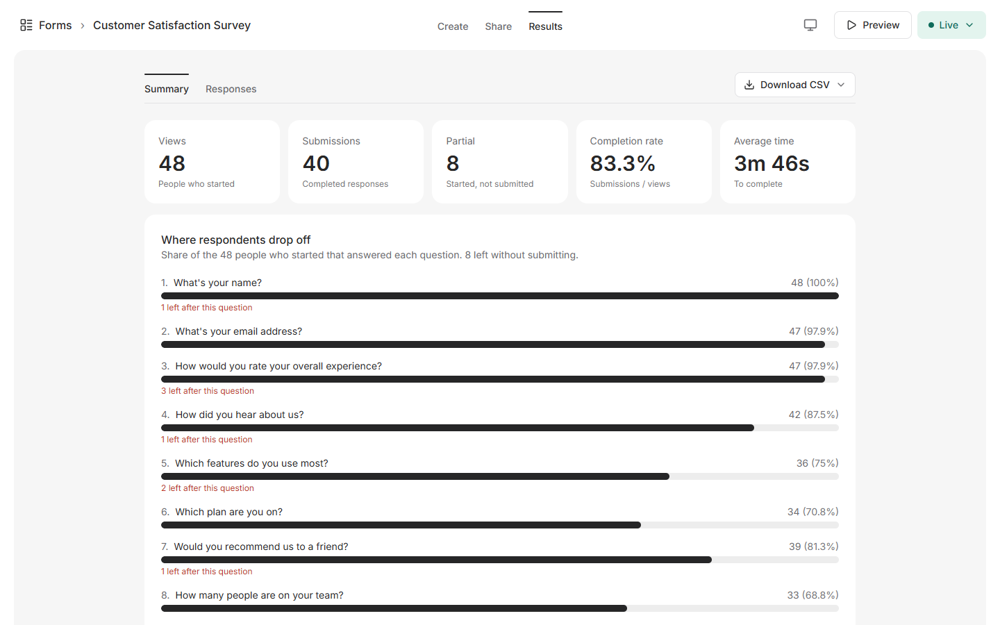
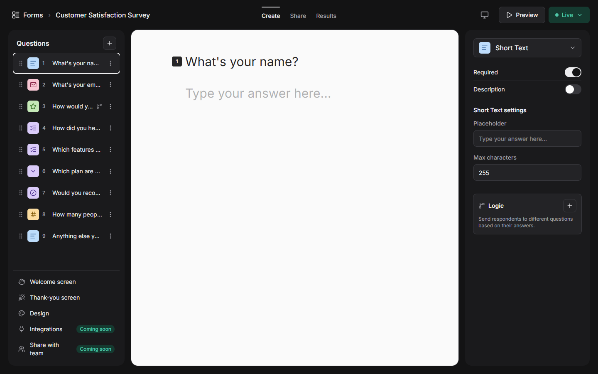
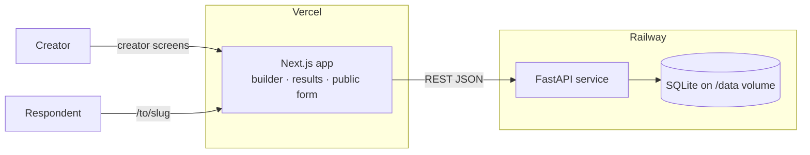
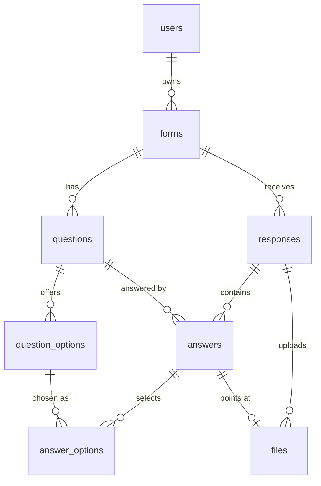

# Typeform Clone

A full-stack clone of [Typeform](https://www.typeform.com): build a form in a drag-and-drop builder, publish it behind a shareable link, collect answers through the signature one-question-at-a-time experience, and read the results.

> Built for a hiring assignment. The original brief is in [`docs/ASSIGNMENT.md`](docs/ASSIGNMENT.md), the plan I followed is [`docs/PLAN.md`](docs/PLAN.md), and a phase-by-phase build log with design decisions is [`docs/PROGRESS.md`](docs/PROGRESS.md).

| | |
| --- | --- |
| **Live app** | _Add your Vercel URL here after deploying (see [Deployment](#deployment))_ |
| **Sample public form** | _`https://<your-app>.vercel.app/to/<slug>`: the seeded "Customer Satisfaction Survey" is a good one to try_ |
| **API docs (Swagger)** | _`https://<your-service>.onrender.com/docs`_ |


| Builder | Respondent flow |
| --- | --- |
|  |  |

| Results: summary | Results: responses |
| --- | --- |
|  |  |

| Logic jumps | File upload question |
| --- | --- |
|  |  |

| Partial responses and drop-off | Dark mode |
| --- | --- |
|  |  |

## Contents

1. [Features](#features) · 2. [Tech stack](#tech-stack) · 3. [Local setup](#local-setup) · 4. [Architecture](#architecture) · 5. [Database schema](#database-schema) · 6. [API overview](#api-overview) · 7. [Feature checklist](#feature-checklist) · 8. [Assumptions](#assumptions) · 9. [Testing](#testing) · 10. [Deployment](#deployment) · 11. [What I would do next](#what-i-would-do-next)

## Features

- **Respondent flow** (`/to/<slug>`, no login): one question at a time, full screen, vertical slide transitions, progress bar, inline errors with a shake, thank-you screen, welcome and "form closed" screens, answers kept across a refresh, and a mobile layout.
- **Keyboard first**: `Enter` or `↓` next, `↑` back, letters pick choices, `Y`/`N` for yes/no, digits for ratings, `Shift+Enter` for a line break; single-choice, dropdown, yes/no and rating auto-advance after a short pause.
- **Builder**: nine question types (short and long text, email, number, multiple choice, dropdown, yes/no, rating, file upload), inline editing on a live canvas that uses the very same input components as the respondent flow, drag-and-drop reorder (mouse and keyboard), per-question settings, debounced autosave with a "Saving… / Saved" indicator, duplicate and delete, preview.
- **Workspace**: create, rename, duplicate, delete (with confirmation), copy link, search and status tabs.
- **Publishing**: publish and unpublish, shareable link, edits to a published form go live immediately.
- **Results**: completion funnel (views, submissions, completion rate, average time), per-question summaries, a paginated responses table, a response drawer with delete, and CSV export.
- **Settings**: 8 theme presets plus custom colours and font, editable thank-you and welcome screens.
- **Validation twice, one rule set**: the browser (zod) and the server (Python validators) apply the same rules and messages per question type; the server is the authority and answers `422` with per-question errors.
- **Logic jumps**: a "Logic +" row on every question opens a rule editor ("if *this answer* then jump to *that question* or the end", with all/any conditions and an "all other cases" fallback). The browser and the server walk the form with the same evaluator, so a required question that a jump skips never blocks a submit, and the progress bar follows the route actually taken.
- **Partial responses**: answers are saved as a respondent moves through the form (and when the tab is hidden), so someone who leaves part-way is still recorded. Results show Views / Submissions / **Partial** / Completion rate, a "where respondents drop off" funnel, a Completed / Partial / All filter and a CSV option that includes partial responses.
- **File upload questions**: drag-and-drop or choose a file, with progress, replace and remove. The creator picks the allowed kind (images, documents, audio and video, or any) and a size limit (up to 25 MB); programs such as `.exe` are never accepted. Files are stored on the backend volume with random names and only the form's owner can download them (as attachments).
- **Dark mode** for the creator app: Light, Dark or follow the system, remembered per browser and applied before first paint (no flash). Respondent pages always use the form's own theme.
- **Placeholders** ("Coming soon"): integrations and webhooks, team sharing, and the payment question type.

## Tech stack

| Layer | Choice | Why |
| --- | --- | --- |
| Frontend framework | Next.js 16 (App Router) + TypeScript (strict) | File-based routes map to the builder, results and the public form |
| Styling | Tailwind CSS 4, design tokens in `@theme` | Fast pixel matching; the form theme becomes CSS variables |
| Animation | framer-motion | The vertical slide between questions, drawer, modals, error shake |
| Drag and drop | `@dnd-kit/core` + `@dnd-kit/sortable` | Accessible, keyboard-capable sortable list |
| Builder state | Zustand | One store for the form being edited, with optimistic updates |
| Server state | TanStack Query | Caching and invalidation for forms and results |
| Client validation | zod | One schema per question type, mirroring the server |
| Toasts / icons | sonner / lucide-react | |
| Backend | FastAPI + Uvicorn | OpenAPI docs at `/docs` |
| ORM / schemas | SQLAlchemy 2.0, Pydantic v2 (+ email-validator) | Typed models and request/response contracts |
| Database | SQLite | Required; one file, on a volume in production |
| Tests | pytest + FastAPI `TestClient` | 136 tests |
| Hosting | Vercel (frontend), Render (backend; Railway also supported) | Config in `render.yaml`; see [Deployment](#deployment) |

The font is **Inter**: Typeform's own typeface is proprietary, so I used the closest free geometric sans. Everything is written from scratch; no code was copied from existing Typeform clones.

## Local setup

You need **Python 3.12+** and **Node 20+**.

**1. Backend** (http://127.0.0.1:8000, docs at `/docs`)

```bash
cd backend
python -m venv .venv
# macOS / Linux:  source .venv/bin/activate        Windows:  .venv\Scripts\activate
pip install -r requirements.txt
uvicorn app.main:app --reload --port 8000
```

The first start creates `typeform.db` and seeds it automatically when it is empty: the default creator, two published forms with realistic responses and one draft (see [Seed data](#seed-data)). To reseed by hand: `python -m app.seed --reset`.

**2. Frontend** (http://localhost:3000)

```bash
cd frontend
npm install
npm run dev
```

Open **http://localhost:3000** (not `127.0.0.1:3000`; CORS allows `localhost:3000` by default).

**Environment variables** (both have a `.env.example`)

| File | Variable | Default | Meaning |
| --- | --- | --- | --- |
| `backend/.env` | `DATABASE_URL` | `sqlite:///./typeform.db` | SQLite file; `sqlite:////data/typeform.db` on Railway |
| `backend/.env` | `FRONTEND_ORIGIN` | `http://localhost:3000,http://127.0.0.1:3000` | Comma-separated CORS origins; the first one builds public links |
| `backend/.env` | `UPLOAD_DIR` | `./uploads` | Folder for files respondents upload; `/data/uploads` on Railway |
| `frontend/.env.local` | `NEXT_PUBLIC_API_URL` | `http://127.0.0.1:8000` | Base URL of the API |

> Use `127.0.0.1`, not `localhost`, for the API on Windows: Node resolves `localhost` to IPv6 first, where uvicorn is not listening, which breaks server-side fetches.

**Checks**

```bash
cd backend && python -m pytest          # 136 tests
cd frontend && npm run lint && npm run build
```

### Seed data

| Form | Status | Questions | Responses |
| --- | --- | --- | --- |
| Customer Satisfaction Survey | Published | Name, email, rating (5), single choice, multiple choice, dropdown, yes/no, number, long text | 40 completed + 8 in progress |
| Event Registration | Published | Name, email, dropdown, number (guests), yes/no, long text | 15 completed |
| Product Research | Draft | Short text, multiple choice, rating, file upload | none |

Two forms show off logic jumps: in the survey a rating of 2 or less jumps straight to the open question, and in the registration form "no dietary requirements" jumps to the end. The seeded responses follow those routes, and the 8 in-progress responses of the survey hold the answers given before they left. Answers come from a fixed `random.seed(42)` with weighted choices, spread over the last 30 days, so the summary charts look realistic and are repeatable.

## Architecture



**Layering (backend).** `routes` (HTTP and status codes only) → `services` (business rules and transactions) → `models` (SQLAlchemy). `schemas` define every request and response. Routes never contain business logic.

**The question-type registry.** Each type is defined once on each side, and every other part reads from it:

| Frontend `lib/questionTypes.tsx` | Backend `app/question_types/` |
| --- | --- |
| label, icon, colour, default properties, `logicKind` | `default_properties`, `has_options`, `logic_kind` |
| `Input` (used by the runner **and** the builder canvas) | n/a |
| `Settings` (builder settings panel) | `validate_properties` |
| `schema` (zod) and `isEmpty` | `validate` and `is_empty` |
| `Summary` (results view) | `stats` |
| `autoAdvance`, `answerForKey` (keyboard) | `to_columns`, `display_value`, and hooks for types that point at stored data (files) |

Logic jumps work the same way: a type only declares its `logic_kind` (text, number, choice, boolean or file) and gets the right operators on both sides. Adding a type means adding one entry per side. There is no `if type == ...` branching in the routes, services or screens.

**One request, end to end (submit).**

1. The respondent presses Enter on the last question; the runner validates every answer with the registry's zod rules.
2. `POST /api/public/forms/{slug}/responses/{token}/submit`.
3. The router parses the body with Pydantic and calls `response_service.submit_response`.
4. The service loads the published form, checks the token is still `in_progress`, and runs each type's validator, collecting **all** errors.
5. If there are errors: `422` with `{"detail": {"code": "validation_error", "errors": {"<question id>": "message"}}}` and nothing is written.
6. Otherwise answers and `answer_options` rows are inserted and the response becomes `completed` in **one commit**.
7. `201` returns the thank-you screen settings and the runner animates to it. On a `422` it jumps to the first failing question and shows the server's message.

**Builder data flow.** TanStack Query holds the form-level data (title, status, settings). A Zustand store holds the questions being edited. Edits update the store instantly, then a debounced (600 ms) PATCH saves the whole question. Saves run strictly one at a time per question, so an older response can never overwrite a newer one. A failed write shows a toast and reloads from the server as the rollback.

### Repository layout

```text
typeform-clone/
├── README.md
├── docs/                         ASSIGNMENT.md · PLAN.md · PROGRESS.md · typeform-ref/ · screenshots/
├── backend/
│   ├── app/
│   │   ├── main.py               app factory, CORS, routers, create tables and seed on startup
│   │   ├── seed.py               demo data (also `python -m app.seed [--reset]`)
│   │   ├── core/                 config · database (FK pragma) · migrations · deps (get_current_user) · errors
│   │   ├── models/               user · form · question (+options) · response · answer (+answer_options) · file
│   │   ├── schemas/              Pydantic request/response models
│   │   ├── routes/               forms · questions · responses · public
│   │   ├── services/             form · question · response · logic · file · summary · export
│   │   └── question_types/       one handler per type + registry.py
│   ├── tests/                    forms · submit validation · results · logic · partial · files · migrations · config
│   ├── requirements.txt (pinned) · railway.json · .env.example
└── frontend/
    └── src/
        ├── app/                  workspace · forms/[id]/(create|share|results) · forms/[id]/preview · to/[slug]
        ├── components/
        │   ├── ui/               Button · Modal · ConfirmDialog · Toggle · Menu · Tabs · Skeleton · ComingSoon
        │   ├── workspace/        FormCard · CreateFormModal · RenameModal · skeleton
        │   ├── forms/            FormShell (top bar) · TitleEditor · PublishControl
        │   ├── builder/          sidebar · canvas · settings panel · TypeSettings/ · logic/ (rule editor) · panels/ (design, thank-you, welcome)
        │   ├── runner/           FormRunner · reducer · screens · inputs/ (the 8 inputs)
        │   └── results/          summary cards · summaries/ · responses table · drawer
        ├── lib/                  api · types · questionTypes (registry) · validation · logic · keyboard · queries · theme · colorScheme
        └── store/                builderStore (Zustand)
```

## Database schema

Eight tables (the seven of the original design plus `files`). Options and answers are normalised so summary stats are plain `GROUP BY` queries and renaming an option never breaks historic responses.



The DDL below is generated from the SQLAlchemy models (`Base.metadata`), so it is exactly what runs:

```sql
CREATE TABLE users (
  id INTEGER NOT NULL, email TEXT NOT NULL, name TEXT NOT NULL, created_at DATETIME NOT NULL,
  PRIMARY KEY (id), UNIQUE (email)
);

CREATE TABLE forms (
  id INTEGER NOT NULL,
  owner_id INTEGER NOT NULL,
  title TEXT DEFAULT 'My new form' NOT NULL,
  slug TEXT NOT NULL,                              -- 8 random chars, used in /to/{slug}
  status TEXT DEFAULT 'draft' NOT NULL,
  settings JSON DEFAULT '{}' NOT NULL,             -- theme, welcome screen, thank-you screen
  published_at DATETIME, created_at DATETIME NOT NULL, updated_at DATETIME NOT NULL,
  PRIMARY KEY (id),
  CONSTRAINT ck_forms_status CHECK (status IN ('draft','published')),
  FOREIGN KEY(owner_id) REFERENCES users (id) ON DELETE CASCADE,
  UNIQUE (slug)
);
CREATE INDEX ix_forms_owner ON forms (owner_id, updated_at);

CREATE TABLE questions (
  id INTEGER NOT NULL,
  form_id INTEGER NOT NULL,
  position INTEGER NOT NULL,                       -- 0-based order
  type TEXT NOT NULL,
  title TEXT DEFAULT '' NOT NULL, description TEXT,
  required BOOLEAN DEFAULT 0 NOT NULL,
  properties JSON DEFAULT '{}' NOT NULL,           -- type-specific settings
  deleted_at DATETIME,                             -- soft delete keeps old answers readable
  created_at DATETIME NOT NULL, updated_at DATETIME NOT NULL,
  PRIMARY KEY (id),
  CONSTRAINT ck_questions_type CHECK (type IN ('short_text','long_text','multiple_choice','dropdown','email','number','yes_no','rating')),
  FOREIGN KEY(form_id) REFERENCES forms (id) ON DELETE CASCADE
);
CREATE INDEX ix_questions_form_pos ON questions (form_id, position);

CREATE TABLE question_options (
  id INTEGER NOT NULL, question_id INTEGER NOT NULL, position INTEGER NOT NULL, label TEXT NOT NULL,
  PRIMARY KEY (id), FOREIGN KEY(question_id) REFERENCES questions (id) ON DELETE CASCADE
);
CREATE INDEX ix_options_question ON question_options (question_id, position);

CREATE TABLE responses (
  id INTEGER NOT NULL, form_id INTEGER NOT NULL,
  token TEXT NOT NULL,                             -- opaque id given to the respondent
  status TEXT DEFAULT 'in_progress' NOT NULL,
  started_at DATETIME NOT NULL, submitted_at DATETIME,
  metadata JSON DEFAULT '{}' NOT NULL,             -- user agent, etc.
  PRIMARY KEY (id),
  CONSTRAINT ck_responses_status CHECK (status IN ('in_progress','completed')),
  FOREIGN KEY(form_id) REFERENCES forms (id) ON DELETE CASCADE,
  UNIQUE (token)
);
CREATE INDEX ix_responses_form ON responses (form_id, status, submitted_at);

CREATE TABLE answers (
  id INTEGER NOT NULL, response_id INTEGER NOT NULL, question_id INTEGER NOT NULL,
  text_value TEXT,                                 -- short_text, long_text, email
  number_value REAL,                               -- number, rating
  boolean_value BOOLEAN,                           -- yes_no
  PRIMARY KEY (id), UNIQUE (response_id, question_id),
  FOREIGN KEY(response_id) REFERENCES responses (id) ON DELETE CASCADE,
  FOREIGN KEY(question_id) REFERENCES questions (id)
);
CREATE INDEX ix_answers_question ON answers (question_id);

CREATE TABLE answer_options (                      -- multiple_choice (1..n) and dropdown (1)
  answer_id INTEGER NOT NULL, option_id INTEGER NOT NULL,
  PRIMARY KEY (answer_id, option_id),
  FOREIGN KEY(answer_id) REFERENCES answers (id) ON DELETE CASCADE,
  FOREIGN KEY(option_id) REFERENCES question_options (id)
);
CREATE INDEX ix_answer_options_option ON answer_options (option_id);

CREATE TABLE files (                               -- uploads for file_upload questions; the bytes are on disk
  id INTEGER NOT NULL, response_id INTEGER NOT NULL, question_id INTEGER NOT NULL,
  answer_id INTEGER,                               -- filled in when the answer is saved
  original_name TEXT NOT NULL, content_type TEXT NOT NULL, size_bytes INTEGER NOT NULL,
  storage_key TEXT NOT NULL,                       -- random name inside the upload folder
  created_at DATETIME NOT NULL,
  PRIMARY KEY (id), UNIQUE (response_id, question_id),
  FOREIGN KEY(response_id) REFERENCES responses (id) ON DELETE CASCADE,
  FOREIGN KEY(question_id) REFERENCES questions (id),
  FOREIGN KEY(answer_id) REFERENCES answers (id) ON DELETE SET NULL,
  UNIQUE (storage_key)
);
CREATE INDEX ix_files_response ON files (response_id);
```

`questions.properties` also holds the question's logic-jump rules under a reserved `logic` key (rules are plain JSON, so branching needed no schema change). It holds type-specific settings: `placeholder` and `max_length` (text), `allow_multiple` / `randomize` / `vertical` (multiple choice), `placeholder` / `alphabetical` (dropdown), `min` / `max` (number), `steps` and `shape` (rating), `max_size_mb` and `allowed_types` (file upload). `forms.settings` holds `theme` (`primary`, `background`, `font`), `welcome_screen` and `thank_you_screen`.

**Design decisions**

- **Typed answer columns, not one JSON blob.** Averages for number and rating, and yes/no counts, are single SQL aggregates.
- **Options as rows.** Stats group by `option_id`, so renaming "Very good" to "Great" keeps historic counts. Removing an option that has responses is refused (`409`).
- **Soft delete for questions.** Deleting a question that has answers sets `deleted_at`: the builder and public form hide it, while the responses table and CSV still show its column.
- **`responses.status` and `started_at`.** A response is created when the respondent first interacts, so completion rate (completed / started) comes for free. Answers are only written on a successful submit.
- **`slug` separate from `id`.** Public URLs never expose sequential ids.
- **Foreign keys on.** SQLite needs `PRAGMA foreign_keys=ON` per connection; it is set in a SQLAlchemy `connect` listener, so `ON DELETE CASCADE` really cascades. Form and response deletes are single bulk `DELETE` statements so the database does the cascading.
- **Partial answers are real rows.** Progress is saved into the same `answers` table while the response is still `in_progress`, and a submit simply replaces them. Statistics and the workspace count only ever read `completed` responses.
- **Files are a table plus bytes on disk.** `files` links an upload to its response, question and (once saved) answer; the file itself lives under `UPLOAD_DIR` with a random name, so a respondent's file name never decides a path. Deleting a response or form deletes its files from disk too.
- **Position, not a linked list.** Reorder rewrites `position` for the whole form in one transaction.
- **Timestamps** are stored as naive UTC and serialised with an explicit `+00:00`.

## API overview

Interactive docs live at `/docs`. Every error uses one shape: `{"detail": {"code", "message", "errors": {<question id or field>: message}}}`.

**Forms** (creator; a default user is injected by `get_current_user`)

| Method | Path | Purpose |
| --- | --- | --- |
| GET | `/api/forms?search=&status=` | List with `response_count` (one grouped query, no N+1) |
| POST | `/api/forms` | Create (201) |
| GET / PATCH / DELETE | `/api/forms/{id}` | Read, rename or update settings, delete (cascades) |
| POST | `/api/forms/{id}/duplicate` | Copy of the form, questions and options |
| POST | `/api/forms/{id}/publish` · `/unpublish` | Publish (422 if no questions) or take offline |

**Questions**

| Method | Path | Purpose |
| --- | --- | --- |
| POST | `/api/forms/{id}/questions` | Add at a position; type defaults and starter options |
| PATCH | `/api/questions/{qid}` | Edit; `options` is diffed (keep, rename, add, delete); `logic` replaces the question's jump rules after validation |
| DELETE | `/api/questions/{qid}` | Hard delete, or soft delete if it has answers |
| POST | `/api/questions/{qid}/duplicate` | Copy inserted below |
| PUT | `/api/forms/{id}/questions/order` | Reorder; must list every live question exactly once |

**Results**

| Method | Path | Purpose |
| --- | --- | --- |
| GET | `/api/forms/{id}/responses?page=&limit=&status=` | Responses newest first (`status` is `completed` (default), `partial` or `all`), counts for each, plus the table's columns |
| GET / DELETE | `/api/forms/{id}/responses/{rid}` | One response with every question and answer, or delete it |
| GET | `/api/forms/{id}/summary` | Views, submissions, partial, completion rate, average time, drop-off funnel, per-question stats |
| GET | `/api/forms/{id}/responses/export.csv?status=` | CSV (formula-injection safe); `status=all` adds partial responses and a Status column |
| GET | `/api/forms/{id}/files/{file_id}` | Download a respondent's file (owner only, always as an attachment) |

**Public** (no auth; published forms only)

| Method | Path | Purpose |
| --- | --- | --- |
| GET | `/api/public/forms/{slug}` | Sanitised definition; 404 for drafts |
| POST | `/api/public/forms/{slug}/responses` | Start a response, returns a `token` |
| PUT | `/api/public/forms/{slug}/responses/{token}/progress` | Save the answers given so far (never complains; invalid or half-typed answers are skipped); `204` |
| PUT | `/api/public/forms/{slug}/responses/{token}/files/{question_id}` | Upload the file for a file question (raw body, name in `X-File-Name`); `413` if too large, `422` if not allowed |
| POST | `/api/public/forms/{slug}/responses/{token}/submit` | Validate and store; `422` with per-question errors |

**Server validation** (on submit, in one transaction): the form is published; the token belongs to the form and is still `in_progress` (blocks double submit); every answered question is a live question of the form; required questions are non-empty; only questions on the respondent's route count (a logic jump can skip a required question, and answers to skipped questions are ignored); and the type's validator passes (email syntax, numeric range, integer rating within `steps`, option ids belonging to the question, single-select has exactly one option, text under `max_length`).

## Feature checklist

| Assignment requirement | Status |
| --- | --- |
| Form builder: title, ordered questions, add / edit / reorder (drag and drop) / delete | Done |
| 8 question types, required toggle, description, live preview | Done |
| Form management: list with status and response count, create / rename / duplicate / delete | Done |
| Publish and unpublish, shareable link, persistence | Done |
| One question at a time, full screen, smooth transitions, keyboard navigation, progress | Done |
| Client and server validation, submit stores the response, thank-you screen, no login | Done |
| Responses table, individual response view, per-question summary stats | Done |
| Typeform look and feel, modals, inline editing, toasts, settings placeholders | Done |
| Seed data: published forms with responses | Done |
| Bonus: CSV export, custom themes | Done |
| Bonus: partial-response tracking and completion rate | Done: answers are saved as respondents go; Partial stat, drop-off funnel, Partial filter |
| Bonus: dark mode | Done: creator app (Light / Dark / System) and dark form themes |
| Bonus: logic jumps / conditional branching | Done: rule editor, all/any conditions, jump to a question or the end, "all other cases" |
| Bonus: file-upload question type | Done |
| Placeholders: integrations, team sharing, payments | "Coming soon" panels |
| Real creator authentication | Simplified: one seeded default creator behind `get_current_user` |

## Assumptions

- **A single default creator.** There is no sign-up or login; the seeded creator is injected by one dependency (`get_current_user`), the single place to swap in real auth.
- **Edits to a published form go live immediately** (there are no versioned snapshots); the top bar shows "Live" so the creator knows.
- **A "view" is a started response**, created when the respondent first interacts, not at page load.
- **Logic only jumps forward**, and a condition may only look at the current or an earlier question, so a form can never loop. A jump to "the end" goes to the thank-you screen (there is a single ending). If a reorder leaves a backward jump, it is ignored when answering and flagged in the editor.
- **Uploaded files are kept** until their response (or form) is deleted, including files from respondents who never submit; there is no automatic retention policy or virus scanning.
- **Progress** is questions passed divided by total, as in Typeform; skipping an optional question still moves it.
- **Option and type changes are protected.** Removing an answered option, or changing the type of an answered question, returns `409`, since mixed historic data would be meaningless.
- **Substitute font.** Inter instead of Typeform's proprietary typeface.
- **Tables are created with `create_all`** at startup (no Alembic), as the plan allows.
- **SQLite on a volume.** One writer is enough for this scale; see below for what would change.

## Testing

- **Backend:** `cd backend && python -m pytest` runs 136 tests: form CRUD and cascades, the options diff, reorder, soft delete, submit validation for every question type (including 422 shape and "nothing saved on error"), double submit, summary statistics, CSV safety, the seed, configuration, logic rules and routes, partial responses and the drop-off funnel, file uploads (limits, allowed types, safe names, ownership, cleanup, downloads) and the schema upgrade for older databases.
- **Frontend:** `npm run lint` and `npm run build` must be clean (zero errors).
- **End to end:** each phase was also verified in real Chrome with Playwright (respondent flow, builder, results, settings, logic jumps, partial responses, file upload, dark mode with an automated contrast check of every creator screen in both modes, and a responsive sweep at 390, 768 and 1440 px). Those scripts were run from outside the repository so the project carries no extra dependency.

## Deployment

The frontend goes on **Vercel** and the API on **Render**. Each needs the other's address, so deploy in this order. The code must be on GitHub first.

### 1. API on Render

1. In Render choose **New > Blueprint**, connect your GitHub account and pick this repository. Render reads [`render.yaml`](render.yaml) and proposes one web service, `typeform-clone-api` (Python, root directory `backend/`).
2. It asks for `FRONTEND_ORIGIN`. Type a placeholder such as `http://localhost:3000` for now; you will set the real value in step 3.
3. Click **Apply** and wait for the first deploy to finish (a few minutes). Open `https://<your-service>.onrender.com/health`: you should see `{"status":"ok"}`. `/docs` shows the interactive API docs.

No Blueprint? Create a **Web Service** by hand with the same values: root directory `backend`, build command `pip install -r requirements.txt`, start command `uvicorn app.main:app --host 0.0.0.0 --port $PORT`, health check path `/health`, and the environment variables from the table below.

### 2. Frontend on Vercel

1. In Vercel choose **Add New > Project** and import the repository.
2. Set **Root Directory** to `frontend` (Vercel detects Next.js by itself).
3. Add the environment variable `NEXT_PUBLIC_API_URL` = your Render address, for example `https://typeform-clone-api.onrender.com` (https, no trailing slash).
4. Click **Deploy**. Your app is at `https://<project>.vercel.app`.

### 3. Connect them

Back in Render, open the service's **Environment** tab and set `FRONTEND_ORIGIN` to your Vercel address, exactly as the browser shows it (`https://<project>.vercel.app`, no trailing slash). Save: Render redeploys by itself. Two things depend on this value:

- **CORS**: the browser may only call the API from this origin.
- **Public form links**: links such as `https://<project>.vercel.app/to/AbC123xy` are built from it.

To allow more than one address (a custom domain, a Vercel preview), separate them with commas; the first one is used for public links.

### 4. Check it works

Open the Vercel address: the workspace should list the three demo forms. Then copy a published form's link, open it in a private window, answer it, and look at the results.

| Environment variable | Where | Value |
| --- | --- | --- |
| `NEXT_PUBLIC_API_URL` | Vercel | the Render address. It is baked into the build, so after changing it, **redeploy** the Vercel project |
| `FRONTEND_ORIGIN` | Render | the Vercel address (comma-separate extra origins) |
| `DATABASE_URL` | Render | `sqlite:///./typeform.db` on the free plan; `sqlite:////data/typeform.db` with a disk |
| `UPLOAD_DIR` | Render | `./uploads` on the free plan; `/data/uploads` with a disk |
| `PYTHON_VERSION` | Render | `3.12.7` (already in `render.yaml`) |

### What the free plan means (read this before a demo)

- **It sleeps.** A free Render service stops after about 15 minutes without traffic, and the next request takes roughly 30 to 60 seconds while it starts. The public form page waits for it (up to a minute) instead of failing, but the first visitor will see a slow load. To keep it awake, point a free uptime monitor (UptimeRobot, cron-job.org) at `https://<your-service>.onrender.com/health` every 10 minutes.
- **Its disk is temporary.** The database and uploaded files are wiped whenever the service restarts (a redeploy, a wake-up after sleeping, routine maintenance). The app handles that gracefully, because on every start it creates the tables and seeds the demo data when the database is empty, so the demo is always usable. But **forms and responses created in the app do not survive a restart.**

### Keeping data (paid plan)

To make data and uploaded files permanent, give the API a persistent disk (Render's Starter plan or higher):

1. Change `plan: free` to `plan: starter` in `render.yaml` and uncomment the `disk:` block (mount path `/data`), or add a disk in the dashboard.
2. Set `DATABASE_URL=sqlite:////data/typeform.db` and `UPLOAD_DIR=/data/uploads`.

The seed only runs when the database is empty, so redeploys never overwrite real data. SQLite on one disk suits a single API instance; a database service such as Postgres would be the next step for more.

### Troubleshooting

| What you see | Likely cause and fix |
| --- | --- |
| The page loads but lists no forms, and the browser console shows a CORS error | `FRONTEND_ORIGIN` on Render does not exactly match the address in the browser bar (check `https`, spelling, and no trailing slash) |
| Requests go to `127.0.0.1:8000` or fail immediately | `NEXT_PUBLIC_API_URL` was not set before the build. Set it in Vercel and **redeploy** |
| A shared form link starts with the wrong address | The first value of `FRONTEND_ORIGIN` is not your Vercel address |
| Everything is slow or "could not load" once, then fine | The free Render service was asleep; retry, or use the uptime monitor above |
| Forms you created have vanished | The free disk was reset by a restart; see "Keeping data" |
| File uploads fail with a size error | The file is over the question's limit (at most 25 MB) |

### Alternatives

- **Railway**: [`backend/railway.json`](backend/railway.json) is included. Use root directory `backend/`, add a volume at `/data`, and set `DATABASE_URL=sqlite:////data/typeform.db`, `UPLOAD_DIR=/data/uploads` and `FRONTEND_ORIGIN`. Railway's volume keeps data across restarts.
- **Upgrading an existing database:** on startup the backend adds the `files` table and, if the database predates file uploads, rebuilds the `questions` table once so its type constraint accepts `file_upload` (existing data is kept). No manual step is needed.

## What I would do next

- **Real authentication and multiple creators**: replace `get_current_user`, add per-owner scoping of every query (already filtered by `owner_id`), and workspaces.
- **Alembic migrations** instead of `create_all` plus the one hand-written upgrade, and Postgres for concurrent writers.
- **Object storage for uploads** (S3 or similar) with signed download links, virus scanning and a retention policy for abandoned responses.
- **Versioned published snapshots**, so editing a live form does not change what is being answered mid-session.
- **More of Typeform's logic**: several endings, jumping to a chosen ending, calculations and score-based branching, and recall (`@field`) in question text.
- **Richer analytics**: time per question, drop-off by device or source, and a funnel that accounts for logic routes.
- **Integrations and webhooks** on submit, and sharing a form with teammates.
